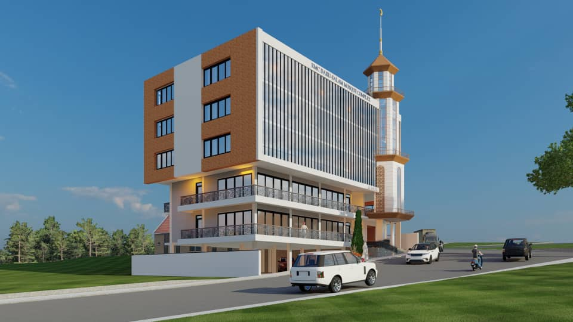
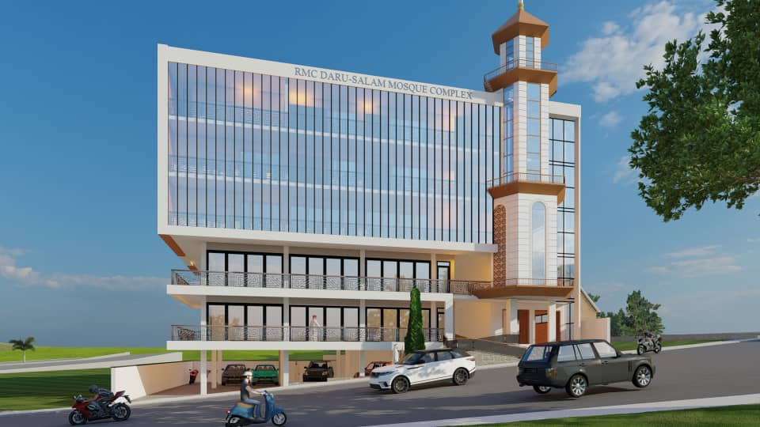
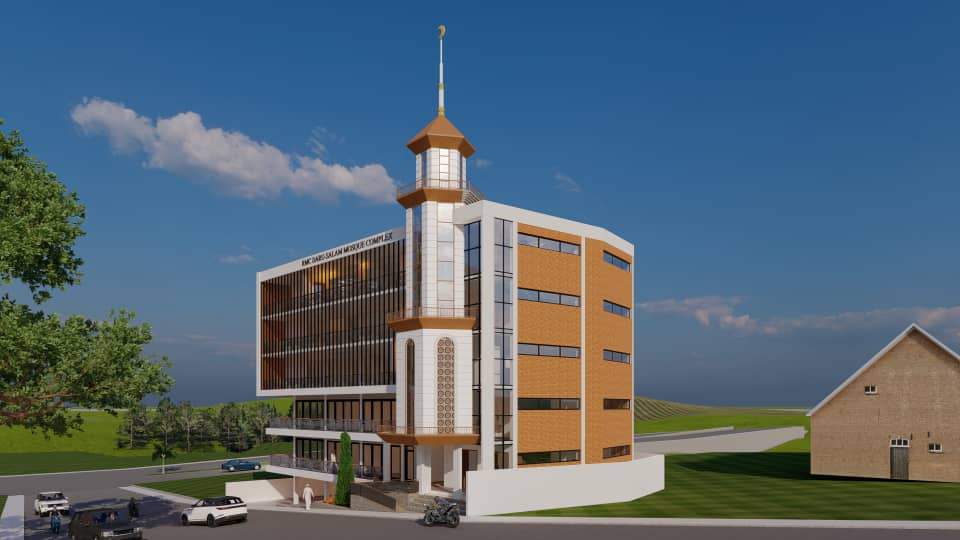

# Gahunda yo Kubaka Umusigiti Mushya

Umusigiti wa Daru salam wubatswe mu 1991 kandi uzamurwa mu 2016. Iyi nyubako ipima metero 18 kuri metero 15 (kuri metero kare 270 kugeza 350), ifite ubuso bwa metero kare 542 (ubunini bw'ikibanza), harimo n'ahantu nyaburanga. Inzira nyamukuru yinyubako izunguruka nka 22 ° mumajyaruguru ugana iburasirazuba, ikayihuza yerekeza mu cyerekezo cya Kaaba i Maka, muri Arabiya Sawudite. Uyu mushinga wavuguruwe muri 2016 urangira muri 2017 hamwe nabakoresha 320 nkubushobozi bwa masdjid yacu uyumunsi, dusanga nintererano zose zo kurangiza iyo mirimo ituruka mumuryango wabasilamu. Uyu munsi turimo gutekereza uburyo dushobora kuzamura kugirango twakire abakoresha 1200 no hejuru yubushobozi hamwe nububiko, ishuri rya qor`an, ibiro byubuyobozi, umusigiti wabagore nabagabo, ibyumba byubucuruzi hamwe nu biro byo gukodesha.

