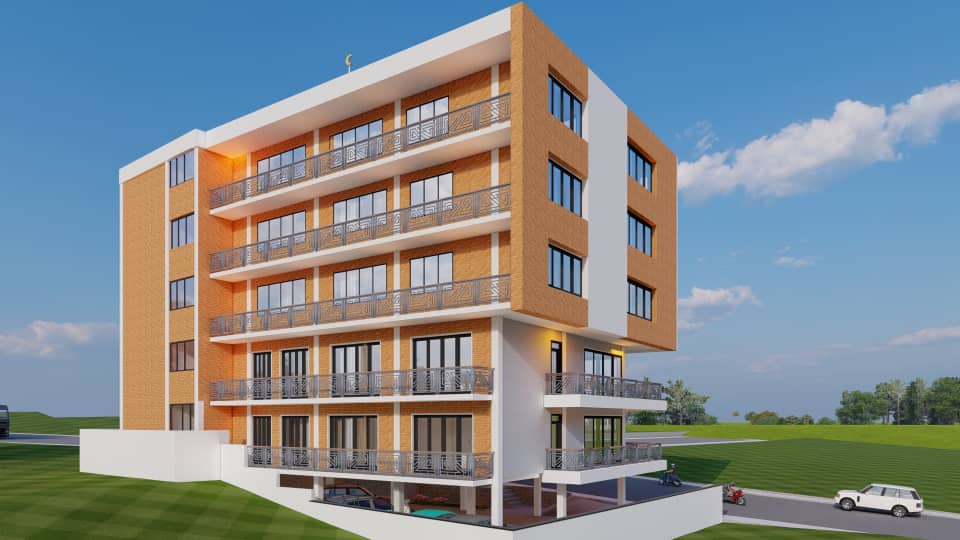

# New Mosque Project

The Daru salam Mosque was constructed in 1991 and upgraded in 2016.The building measures approximately 18 m by 15 m (on 270 to 350 sqm), covering an area of 542 sqm (plot size), including exterior landscape. The main axis of the building is rotated about 22° north to east, aligning it in the direction of the Kaaba in Mecca, Saudi Arabia.
The project was renovated in 2016 and completed in 2017 with 320 users as capacity of our masdjid today, found and all donations to complete that works is  from muslim community.
Today we are thinking about how we can upgrade to receive 1200 users and above as capacity with gallery, quran school, administration office, women and men mosque, shopping rooms and an office for rent.

